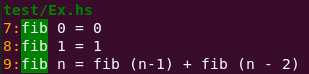

## hs-search

Search for Haskell identifiers under a directory using haskell-src-exts

## Dependencies

[Haskell Stack](https://docs.haskellstack.org/en/stable/README/)

## Install

```
stack install
```

## Usage

```
hs-search [symbol] [optional path]
```

If no path is specified, search the current directory. e.g. in this project `hs-search fib` produces:

